# Employee operations — the Oasis staff system

The employee half of Oasis: who works here, when they work, what they have been
trained on, what they have to complete, what needs doing tonight, and who is
running the event. It lives at `/staff`, shares one sign-in with the admin, and
is built on the same Supabase project, the same design tokens and the same email
service as everything else.

This is the document to read before touching any of it.

Migrations: `0021_staff_roles.sql`, `0022_employee_operations.sql`,
`0025_schedule_periods_and_briefs.sql`.

> **Applied to the live project** (`yrfvnqgybbvbkwonvycw`), 19 September 2026.
> `supabase/tests/employee-operations-rls.sql` was run against the live database
> immediately after and was silent — the access rules hold under real Row Level
> Security, not only locally. The `employee-files` bucket is confirmed private.
> What remains before the first real employee uses it is steps 4 onward in
> [Going live](#going-live): add the first manager, configure the requirements,
> write the first training modules, add the team.

---

## The one-minute version

```
An employee opens /staff on their phone
  → middleware refreshes the Supabase session and gates the subtree
  → getStaffContext() resolves: the account (profiles), the person (employees),
    the operational role, and which locations they work at
  → staffHome() answers, in one read: am I working today, what time, where,
    what position, what is on tonight, what needs me
  → every mutation goes through runOps(capability, …), which checks the
    capability BEFORE it has a database handle, then writes through the
    signed-in person's own session so RLS and the column guards apply
  → anything that concerns someone else raises a notification, and the seven
    inbox-worthy kinds also send a staff email through the existing service
  → anything a manager did to someone else's record lands in ops_audit_log
```

**Three independent checks stand between a request and a write:** the capability
matrix in `src/server/staff/permissions.ts`, the Row Level Security policies in
migration 0022, and the `BEFORE` triggers that limit which columns a non-manager
may change. Removing any one of them leaves the other two.

---

## Why it is shaped this way

**Identity is not duplicated.** An `employees` row points at the `auth.users` row
it belongs to; `profiles.role` keeps deciding what the account may do. A manager
is `profiles.role = 'admin'` with an employee row. A bartender is
`profiles.role = 'staff'` with one. A person who has been added but has not
signed in yet is an employee row with `user_id` null. There is no second user
table and no second password.

**One requirements primitive.** Documents, policies, certifications and the
onboarding checklist are all a `requirement_types` row plus, per employee, an
`employee_requirements` row. What differs is the `kind` — acknowledge, upload,
external link, manager verification, a training module, or a `system` check read
off the profile itself — and whether it expires. Twenty features, two tables.

**One notification abstraction.** `notify()` writes the in-app row and hands the
same payload to every registered channel. Email is one channel
(`src/server/staff/emails.ts`); push and SMS are the same call with another
channel later. Nothing that raises a notification knows how it is delivered.

**One locations model.** `locations` exists from this migration and Lockport is
its first row, with a fixed id so seeds and tests can name it. Events, shifts,
tasks, checklists, incidents and announcements can all belong to one. Every
location column is nullable and every existing event row was backfilled, so
nothing that inserted an event before 0022 had to change.

**Events are the existing events.** Nothing here has its own event table. A
staffing assignment references `event_occurrences(id)` — text, because that is
what it is in production (`tickeri:xxxx` for imported rows) — and ticket counts
come from the `event_sales_summary` view the ticketing system already maintains.

---

## Routes

The navigation is four things for an employee and five for a manager, and it is
built from **capabilities, not role names** — an account that gains scheduling
gains the tab in the same moment.

```
employee   Home · Schedule · Training · Profile
manager    Home · Schedule · Team · Training · Operations
contractor (one screen, no nav)
```

There is deliberately no "Manage" dropdown. The version this replaced hung ten
entries off the header, which meant a bartender's app advertised nine systems
they could not open. Those tools did not disappear — they moved behind
**Operations**, which is a screen rather than a menu, and a screen can say how
many documents are expiring and who is waiting on a decision.

### The employee app

| Route | What it is |
|---|---|
| `/staff` | **Today.** Am I working, what is on tonight, what is left on my list, has anything been announced, when am I next in. |
| `/staff/schedule` | My week, with "being prepared" shown honestly for a week that is not out yet. |
| `/staff/schedule/shift/[id]` | One shift: clock in and out, the event, the note, offer it up, its history. |
| `/staff/schedule/coverage` | Shifts coworkers have offered, and open shifts nobody has. |
| `/staff/availability` | The weekly pattern, and one-off days. |
| `/staff/time-off` | Request, withdraw, and the decisions. |
| `/staff/tasks` · `/staff/tasks/[id]` | The full list, including what is finished. Not in the navigation: today's lines live on Home. |
| `/staff/checklists/[id]` | A live checklist: tick a line, attach a photo where the line asks. |
| `/staff/training` · `/staff/training/[id]` | Read the module, take the quiz. |
| `/staff/documents` | My documents: acknowledge, upload, see what expires. |
| `/staff/onboarding` | The checklist, each item completable in place. |
| `/staff/profile` | Me. The fields I own; the ones a manager owns are read-only. |
| `/staff/events` · `/staff/events/[id]` | The nights coming up, and the brief for one: doors, crowd, call time, dress, who is running it. No money. |
| `/staff/incidents/new` | Report something. Goes to the managers; the log itself stays closed. |
| `/staff/announcements` | The feed, with acknowledgement. |
| `/staff/notifications` | Everything that has happened to me. |

### The manager surfaces

| Route | What it is |
|---|---|
| `/staff/schedule` | **The board.** The same route an employee opens; a manager gets people down the side, days across the top, drafts, warnings, filters, publish and copy. `?edit=<id>` and `?add=<date>` open the editor as a drawer over the week. |
| `/staff/operations` | Tonight, the decisions waiting, and the index of every other module. |
| `/staff/operations/time-off` | Approve and deny, with what it collides with. |
| `/staff/schedule/coverage` | Approve and deny shift changes, alongside the employee's own view of them. |
| `/staff/team` · `/staff/team/[id]` · `/[id]/edit` · `/new` | The directory and one person, in eight sections. |
| `/staff/operations/onboarding` | New hires: not started, in progress, ready. |
| `/staff/operations/documents` · `/types` | Missing, expiring, expired, waiting; and what Oasis asks for. |
| `/staff/operations/training` · `/[id]` · `/[id]/edit` · `/new` | The modules, and who is cleared. |
| `/staff/operations/tasks` · `/new` · `/[id]/edit` | Everyone's tasks. |
| `/staff/operations/checklists` · `/templates/…` | Today's runs, and the templates behind them. |
| `/staff/events/[id]` | The same night, plus the staffing board, the brief editor and — only with `events.view_money` — what it has taken. |
| `/staff/contractors` · `/[id]` · `/new` | DJs, instructors, photographers, their bookings, and the invitation that gives one a sign-in. |
| `/staff/incidents` · `/[id]` · `/new` | The log. Reading it is manager-only; writing to it is not. |
| `/staff/announcements/manage` · `/[id]` · `/new` | Post, and see who has read. |
| `/staff/search` | People, phones, emails, positions, contractors, event staffing. |
| `/staff/locations` | Owner only. Lockport, and the next one. |

`/staff/operations/schedule*` and `/staff/operations/coverage` redirect to their
new homes (`next.config.ts`), so old bookmarks and old notification links still
land somewhere correct.

### The contractor app

| Route | What it is |
|---|---|
| `/staff/bookings` | The whole thing. Their own bookings, when to arrive, payment status, one phone number. Every other `/staff` route redirects them here. |

A contractor account carries exactly one operational capability,
`contractors.view_self`. They are not employees with fewer buttons: there is no
schedule, no team, no training, no other bookings, and no navigation, because
there is nowhere else to go.

The admin keeps its own job — configuring the business — and gains one thing: a
**Staffing** section on an event's page (`/admin/events/one/[id]`) that renders
the same board as `/staff/events/[id]`, from the same data.

---

## The data model

```mermaid
erDiagram
    auth_users        ||--o| profiles          : "role"
    auth_users        ||--o| employees         : "is"
    locations         ||--o{ employees         : "home"
    locations         ||--o{ shifts            : "at"
    locations         ||--o{ event_occurrences : "at"
    employees         ||--o{ employee_positions : "works as"
    positions         ||--o{ employee_positions : ""
    employees         ||--o{ employee_locations : "also at"
    employees         ||--o{ shifts             : "assigned"
    employees         ||--o{ availability_rules : "states"
    employees         ||--o{ time_off_requests  : "asks"
    employees         ||--o{ employee_requirements : "owes"
    requirement_types ||--o{ employee_requirements : ""
    employees         ||--o{ training_assignments  : "assigned"
    training_modules  ||--o{ training_assignments  : ""
    training_modules  ||--o{ training_sections     : "content"
    training_modules  ||--o{ training_questions    : "quiz"
    training_questions ||--|| training_answer_keys : "graded by"
    training_assignments ||--o{ training_attempts  : "scored"
    shifts            ||--o{ shift_history      : "changed"
    shifts            ||--o{ shift_requests     : "offered"
    employees         ||--o{ tasks              : "assigned"
    event_occurrences ||--o{ event_assignments  : "staffed by"
    employees         ||--o{ event_assignments  : ""
    contractors       ||--o{ contractor_bookings : "booked"
    event_occurrences ||--o{ contractor_bookings : ""
    checklist_templates ||--o{ checklist_runs    : "run as"
    checklist_runs    ||--o{ checklist_run_items : "lines"
    employees         ||--o{ staff_notifications : "told"
    employees         ||--o{ employee_notes      : "about (manager-only)"
    incidents         ||--o{ incident_employees  : "involved"
```



Thirty-five tables, one storage bucket, and two nullable columns added to the
event tables. The ones worth knowing individually:

### People

**`locations`** — `slug`, `name`, address parts, `timezone`, `active`. Lockport is
inserted by the migration with the fixed id
`0a515000-0000-4000-8000-000000000001`, mirrored in `src/content/locations.ts`
as the typed fallback. Every time a shift is rendered, its location's timezone is
what formats the clock — there is no `America/Chicago` constant anywhere in the
staff code.

**`employees`** — the person. Legal and preferred name, contact, status
(`invited`, `active`, `on_leave`, `inactive`), employment type, home location,
manager, hire and start dates, emergency contact, shirt size, preferred language
(`en`/`es`), optional birthday month and day, private photo path, whether they
want email, and the two onboarding stamps. Positions and extra locations are join
tables, because a bartender who also servers on Sundays is two rows, not a
delimited string.

**`positions`** — eleven to start: manager, server, bartender, host, busser, door,
security, DJ, event staff, kitchen, content & social. Text ids with a department,
so adding one is an insert.

**`employee_notes`** — manager-only coaching, attendance, recognition and
follow-up notes. No policy grants an employee any access to this table, including
to notes about themselves.

### Requirements

**`requirement_types`** — what management asks for: a title, a category, a `kind`,
who it applies to (positions and locations; empty means everyone), whether it is
required, whether it is part of onboarding, and how long it lasts. Twelve ship
with the migration as the starting onboarding checklist.

**`employee_requirements`** — where one person stands on one of them: status,
file path, credential number, issued and expiry dates, acknowledgement,
submission, and who verified it.

**The effective state is computed at read time.** An upload whose `expires_on`
has passed reads as `expired` no matter what the stored status says, and one
inside thirty days reads as `expiring`. The dashboard therefore cannot drift from
the truth, and no cron has to walk the table to keep it honest.

> **Nothing legal is invented.** The twelve rows are slots. Whether a food-handler
> certificate or a BASSET card is *required* for a position is an Oasis policy
> setting on the row, not an assertion this system makes. The tax and payroll row
> is a manager verification against whatever payroll provider Oasis uses; no form
> is generated and no filing is claimed.

### Training

**`training_modules`** — title, description, category, minutes, who it applies to,
whether it is required, passing score, retraining interval, **version**, and
status. **`training_sections`** are its content in order: text, video, image,
checklist or external link. **`training_questions`** are the quiz — multiple
choice, true/false, or choose-all-that-apply — and their options.

**`training_answer_keys`** is a separate table for one reason: the only policy on
it is manager-only, so an employee's browser cannot receive the answers before
they submit, whatever the page does. Grading runs in
`grade()` (pure, unit-tested) on the server, and the result — including which
options were right and why — comes back only in the response to the submission.

**Versions.** An assignment records `completed_version`. When a manager makes a
material change they tick one box, the module's `version` increments, everyone
who had completed it is notified, and their assignment reads as *outdated* until
they do the new one. A typo fix is just a save.

### Scheduling

**`shifts`** — a location, a position, an instant range, optionally an employee
(null is an open shift), optionally an event, a note, a status
(`draft`/`published`/`cancelled`), a repeat group, and the attendance columns.
**`shift_history`** records every change with the row before and after, so a
reassignment is never a mystery.

**`schedule_periods`** (migration 0025) — one row per `(location, week)`, with a
status, who released it and when. The shift-level flag is right for one shift and
wrong for a week: a manager needs to build next week privately and release the
whole thing at once, and an employee needs to be able to tell the difference
between *"there is nothing next week"* and *"next week is not out yet"*. Without
the week as a thing, those two look identical, and the honest answer to the
second is not silence.

```
no row, or status = draft      employees see nothing; the app says
                               "Next week's schedule is being prepared."
status = published             the week is out; published_at is when

notified_at                    set the FIRST time a week goes out and never
                               cleared. It is what stops the fan-out running
                               twice: a manager who adds a Thursday shift on
                               Wednesday and publishes again tells one person,
                               not fourteen.
```

Publishing is `publishPeriod()` in `src/server/staff/periods.ts`: it flips every
draft in the window to published, marks the week live, and hands the caller
`firstRelease` so the action knows whether it is announcing a week or a change.
A week is never un-published once staff have been told — `unpublishSchedule`
refuses, and says why. Cancelling the individual shifts is the honest version.

**Attendance is optional and honest.** `attendance_status` defaults to
`not_tracked`. An employee can clock in from an hour before their shift; late is
more than five minutes after the start, left early is more than fifteen before
the end. A manager can correct any of it, and the correction is stamped. There is
no geofencing, real or fake, and this is not payroll.

**`availability_rules`** (one row per weekday) and **`availability_exceptions`**
(one-off days) belong to the employee. A manager reads them and is warned by
them; no policy or function here lets a manager write them.

**Warnings never block.** `scheduleWarnings()` in `src/lib/staff/conflicts.ts` is
pure and returns, in reading order: approved time off, an availability conflict,
an overlap with another shift. A manager sees *"Carlos marked himself unavailable
on that weekday"* and can save anyway. A shift that closes after midnight counts
as touching both calendar days.

**`shift_requests`** — give up, swap, or ask for cover. Carlos offers, everyone
who works that position is told, Maria claims it, a manager approves, and only
then does `reassignShift()` move it — which is what puts Carlos in the history.

### Operations

**`tasks`** — title, description, assignee, location, related event, due instant,
priority, status. **`checklist_templates`** and their items are written once;
**`checklist_runs`** copy the lines in, so editing a template next month does not
rewrite what was ticked last Friday. A line can require a photo or a note.

**`event_assignments`** — a person in a role on an event. Assigning also creates
their published shift for the night, so the schedule and the staffing board
cannot disagree about who is on. `readiness` is computed: a door assignment whose
scanner training is not complete says so, on the board, before the night.

**`event_briefs`** (migration 0025) — the operational half of a night: call time,
dress, expected guests, the manager running it, and the notes the floor needs.
Separate from `event_occurrences` because that table carries the publish guard
and the draft/live editorial split from 0003, and none of that applies to an
internal note. Every employee reads it; managers write it; **no money is in the
shape at all**, which is what lets `events.view_brief` be an employee capability.

**`contractors`** and **`contractor_bookings`** — the DJ, the painter, the
photographer: service type, usual rate, how they get paid, W-9 status, and per
booking the agreed amount, deposit, paid amount, payment note, and an
`arrival_note` written *for* the contractor (which door, where to park, who to
ask for) kept separate from the internal `note`. Operational tracking, one place
instead of text messages. **Not payroll and not accounting.**

`current_contractor_id()` mirrors `current_employee_id()`: a contractor with a
sign-in resolves to their own row, reads their own bookings through two
additional `SELECT` policies, and every other staff table stays closed to them.
A manager gives them that sign-in from the contractor's page — deliberately a
separate action from adding the contractor, because most DJs never need a login
and an account nobody asked for is an account nobody closes.

### Everything else

**`staff_announcements`** with **`staff_announcement_reads`** (who read, who
acknowledged), **`staff_notifications`** (the in-app centre),
**`ops_comments`** (one polymorphic thread used by tasks, requests, shifts,
incidents, checklists and event staffing), **`incidents`** with
**`incident_employees`**, and **`ops_audit_log`**.

---

## Roles and capabilities

`profiles.role` gains two values in migration 0021: `staff` and `contractor`.
Neither has a single content capability — the matrix in
`src/server/permissions.ts` gives them an empty array — so every policy written
since 0001 already excludes them, and `canOpen()` refuses them every admin
section.

The **operational** role is derived, never stored:

| `profiles.role` | + employee row? | operational role |
|---|---|---|
| `owner` | either | `owner` |
| `admin` | either | `manager` |
| `staff` | active | `employee` |
| `editor` | active | `employee` |
| `staff` / `editor` | none, or inactive | `none` |
| `contractor` | — | `contractor` |
| anything, account inactive | — | `none` |

**Deactivating an employee locks the app in one step.** `current_employee_id()`
returns null for an inactive or archived employee, which empties every
policy that depends on it; and setting an employee to inactive in the UI also
sets `profiles.active = false`, which `getStaff()` already treats as no access.

The guiding rule is **transparency is not authority**: seeing who is on tonight,
or what the event needs, is a different thing from being able to change it, so
the read and the write are separate capabilities and the read is the one an
employee gets.

The thirty-two capabilities, and who holds them:

| Capability | Owner | Manager | Employee | Contractor |
|---|:-:|:-:|:-:|:-:|
| `staff.view_self` | ✓ | ✓ | ✓ | |
| `staff.view_roster` | ✓ | ✓ | ✓ | |
| `staff.view_team` | ✓ | ✓ | | |
| `staff.manage_team` | ✓ | ✓ | | |
| `staff.manage_access` | ✓ | | | |
| `schedule.view_self` | ✓ | ✓ | ✓ | |
| `schedule.view_team` | ✓ | ✓ | | |
| `schedule.manage` | ✓ | ✓ | | |
| `schedule.publish` | ✓ | ✓ | | |
| `availability.manage_self` | ✓ | ✓ | ✓ | |
| `timeoff.request` | ✓ | ✓ | ✓ | |
| `timeoff.approve` | ✓ | ✓ | | |
| `coverage.request` | ✓ | ✓ | ✓ | |
| `coverage.approve` | ✓ | ✓ | | |
| `training.view_self` | ✓ | ✓ | ✓ | |
| `training.manage` | ✓ | ✓ | | |
| `documents.view_self` | ✓ | ✓ | ✓ | |
| `documents.manage` | ✓ | ✓ | | |
| `tasks.view_self` | ✓ | ✓ | ✓ | |
| `tasks.manage` | ✓ | ✓ | | |
| `checklists.complete` | ✓ | ✓ | ✓ | |
| `checklists.manage` | ✓ | ✓ | | |
| `events.view_brief` | ✓ | ✓ | ✓ | |
| `events.staff` | ✓ | ✓ | | |
| `events.view_money` | ✓ | ✓ | | |
| `incidents.report` | ✓ | ✓ | ✓ | |
| `incidents.manage` | ✓ | ✓ | | |
| `contractors.manage` | ✓ | ✓ | | |
| `contractors.view_self` | | | | ✓ |
| `announcements.manage` | ✓ | ✓ | | |
| `notes.manage` | ✓ | ✓ | | |
| `locations.view_all` | ✓ | | | |
| `locations.manage` | ✓ | | | |
| `system.preview_role` | ✓ | | | |

The three pairs worth reading twice:

- **`events.view_brief` / `events.view_money`.** Everyone working a night reads
  the brief — doors, expected crowd, call time, dress, who is running it, what
  to watch for. Only a manager sees what the night has taken, and the sales read
  is not even *issued* for an employee: a screen cannot leak a number it was
  never handed.
- **`incidents.report` / `incidents.manage`.** The person who saw it writes it
  down, because a report that has to wait for a manager is a report that never
  gets written. They cannot then read the log — including their own entry — name
  a coworker in it, or close one. `saveIncidentAction` narrows all of that
  server-side, so a hand-posted form gets the same treatment.
- **`contractors.manage` / `contractors.view_self`.** A manager sees every
  contractor and every rate. A contractor sees their own bookings and nothing
  else of the restaurant.

### Previewing as a role

`system.preview_role` is the owner's answer to "what does a bartender actually
see?". It is **not impersonation**: nothing signs in as anybody. A cookie asks
the capability layer to treat the session as carrying less authority, and
`clampPreview()` can only ever move *down* the ladder
(`none < contractor < employee < manager < owner`), so a forged cookie buys
nothing — at worst you lock yourself out of your own tools for an hour, which
the banner across the top undoes in one tap. The control itself is checked
against the account's **real** role (`requireActualOps`), otherwise an owner
previewing as an employee would no longer be allowed to stop.

Every cell is asserted in `src/server/staff/permissions.test.ts`, written out
rather than derived — a test that computes the answer the same way the code does
proves nothing.

**Only the owner can change an account's tier.** A manager cannot promote
themselves, and `profiles_owner_write` from migration 0003 refuses it in the
database as well as in the UI.

---

## Security

### Row Level Security

Every one of the thirty-five tables has RLS enabled and explicit policies. Two
`SECURITY DEFINER` helpers do the work:

```sql
public.is_manager()          -- profiles.role in ('owner','admin')
public.current_employee_id() -- the caller's own employee row, or NULL
```

The shapes, in short:

- **Your own row or nothing** — `employees`, `employee_requirements`,
  `training_assignments`, `training_attempts`, `availability_*`,
  `time_off_requests`, `tasks`, `staff_notifications`,
  `staff_announcement_reads`. A manager sees all of them.
- **Manager only, with no employee policy at all** — `employee_notes`,
  `training_answer_keys`, `incidents`, `incident_employees`, `contractors`,
  `contractor_bookings`, `ops_audit_log`.
- **Yours, or an open published one** — `shifts`. A draft is invisible until it
  is published; an open shift is visible to every active employee, because that
  is how it gets picked up.
- **Everyone active** — `shift_requests` and published `staff_announcements`,
  narrowed in the application by position and location.
- **Published only** — `training_modules`, `training_sections`,
  `training_questions`, `requirement_types`.

### Column guards

A policy can say *whether* you may update a row, not *which columns*. Five
`BEFORE` triggers in 0022 close that:

| Trigger | A non-manager may change only |
|---|---|
| `employees_guard_self_update` | preferred name, phone, emergency contact, shirt size, language, birthday, photo, email preference — on their own row |
| `time_off_requests_guard` | `pending` → `cancelled`, on their own request. Inserts are forced to `pending`. |
| `shift_requests_guard` | open their own shift, claim someone else's, withdraw their own |
| `employee_requirements_guard` | acknowledge, upload, and the dates — never `verified_by` or a waiver |
| `shifts_guard_employee` | `clock_in_at`, `clock_out_at`, `break_minutes` |
| `tasks_guard_employee` | `status`, `completed_at` |

Each guard lets two callers straight through. A manager, obviously. And the
**service role**, which has no `auth.uid()` — that is the server acting after
its own capability check (grading a quiz against the manager-only answer key,
linking a new sign-in to an employee row, fanning out notifications), and it
already bypasses RLS entirely, so refusing it there would protect nothing and
break those writes. An anonymous caller never reaches a guard at all: no policy
on any of these tables grants `anon` a row in the first place.

All five functions are revoked from `anon` and `authenticated`: a trigger fires
without checking the caller's `EXECUTE` privilege, so revoking costs nothing and
removes five endpoints that should never have been reachable.

One case the guard has to *allow* rather than refuse: an **open shift** has no
owner to give up, so picking one up is an insert where `requested_by` and
`claimed_by` are both you, and the trigger forces it to `claimed` so a manager
still approves it.

### Files

Employee documents, photos, checklist proof and incident attachments go to the
**private** `employee-files` bucket under `employees/<employee id>/…`. Nothing in
it has a public URL. Storage policies let an employee read and write only their
own folder and a manager any folder; the app hands out signed URLs that expire in
ten minutes, generated server-side after the capability check. Uploads are capped
at 15 MB and limited to PDF and common image types.

### Proving it

```bash
psql "$DATABASE_URL" -f supabase/tests/employee-operations-rls.sql
```

One transaction, always rolled back, that impersonates a manager, two employees
and a contractor by setting the same JWT claims PostgREST sets, and asserts the
eleven rules that matter — including that an employee cannot read a coworker's
documents, cannot read manager notes about themselves, cannot read the answer
keys, cannot approve their own time off, cannot give themselves a position, and
that a manager cannot promote themselves to owner. Silence means it passed.

The server-side layer is proved separately, without a database, in
`src/server/staff/workflows.test.ts`.

---

## The server architecture

```
src/content/staff-types.ts        view models — plain data, no server imports
src/content/locations.ts          the typed location fallback
src/content/staff-reference.ts    positions, Lockport, the onboarding checklist

src/lib/staff/time.ts             zoned dates and clocks. Pure.
src/lib/staff/conflicts.ts        scheduling warnings. Pure.

src/server/staff/permissions.ts   the operational matrix. Pure.
src/server/staff/session.ts       getStaffContext(), requireOps()
src/server/staff/db.ts            the three handles, and when each is right
src/server/staff/*.ts             one module per domain
src/server/staff/emails.ts        the email channel for notifications
src/server/staff/audit.ts         ops_audit_log
src/server/staff/demo.ts          a realistic week, for development only

src/server/actions/staff/*.ts     server actions; every one starts with runOps()
src/components/staff/*            the UI primitives and the shell
src/app/staff/*                   the screens
```

**Three database handles**, named so a reviewer can grep for the one that
bypasses RLS:

| Handle | Authority | Used for |
|---|---|---|
| `opsReadDb()` | service role | reads, after the server has checked the capability |
| `opsWriteDb()` | the signed-in person's session | every ordinary write: RLS and the guards apply |
| `opsElevatedDb()` | service role | the few writes done *on someone's behalf* after verifying: grading a quiz, provisioning requirements, notifications, the audit trail |

**The `Db` interface gained two things** (`src/lib/db/types.ts`): `whereIn` and a
single `range`, implemented in both the Supabase and the local adapter. A week of
shifts is one query rather than a table scan, and the local development database
behaves the same way.

**Every mutation looks like this:**

```ts
export async function decideTimeOffRequest(_prev: ActionState, form: FormData) {
  return runOps('timeoff.approve', async ({ db, context }) => {
    …
  });
}
```

`runOps` checks the capability before it has a database handle, turns a thrown
error into a sentence a person can act on, and revalidates the staff routes.

---

## Notifications and email

`notify()` writes one `staff_notifications` row per employee and passes the same
payload to every registered channel. It never fails the action that raised it: a
lost *"your shift changed"* is logged; a lost shift is not acceptable.

Seven kinds are worth an inbox, and those are the seven staff email templates —
added to `src/emails/registry.ts`, rendered by one `StaffShell` component,
previewable with `npm run email:dev`, and sent through
`emailService.sendStaffNotice()` so they land in `email_log` like everything
else:

| Notification | Email | Raised by |
|---|---|---|
| `welcome` | Welcome to the team | A manager adds an employee and invites them |
| `schedule_published` | Schedule published | Publishing a week — **one email per person, listing their shifts**, and only on the first release |
| `shift_changed` / `shift_cancelled` | Shift changed | A published shift moves, is cancelled, or coverage is approved |
| `time_off_decided` | Time-off decision | A manager decides |
| `training_assigned` | Training assigned | A module is assigned or re-required |
| `document_expiring` | Document expiring | Thirty days out, from the hourly cron |
| `event_assignment` | Event assignment | Someone is put on an event |

Everything else — a task assigned, an announcement posted, a swap claimed, a
document verified, an incident reported to the managers — stays in the app. An
employee can turn their own email off in their profile; in-app always arrives.

**Restraint is the feature.** Publishing a schedule is the one action that
reaches everyone at once, so it is the one with a guard on it: the first release
of a week tells everybody on it, and every release after that tells only the
people whose shifts just appeared. `src/server/actions/staff/publish.test.ts`
asserts both, because an app that pings people for nothing stops being read.

**Push plugs in here, not somewhere new.** `registerNotificationChannel()` takes
anything with a `deliver(notification, employeeId)` method; the email channel
registers itself on import of `src/server/staff/emails.ts` and is the worked
example. A native iOS push channel is a second `registerNotificationChannel()`
call and a table of device tokens — nothing that *raises* a notification knows or
cares how it is delivered, so no calling code changes.

**One clock.** Everything about requirements is computed when somebody looks —
a certificate whose expiry has passed reads as expired with no job keeping it
honest. The exception is telling an employee *thirty days early*, because nobody
looks at a bar card a month out. `sweepExpiringDocuments()` runs inside the
existing `/api/cron/reminders` route, says it once per document per renewal
(enforced against `staff_notifications`, so a replayed cron is harmless), and
is wrapped so a staff job can never fail the ticket reminders beside it. On a
database without migration 0022 it finds nothing and the route behaves exactly
as it did before.

**Staff email is `audience: 'staff'`**, so `EMAIL_DELIVERY_ENABLED` — the guest
switch — does not gate it. Sign-in and schedule notices have to work before Oasis
is ready to email guests. They still need `RESEND_API_KEY` and
`ORDERS_FROM_EMAIL`, and with neither set every send is logged as `skipped` with
the reason.

---

## Multi-location

Lockport is a row, not an assumption.

- `locations` ships with Lockport and the app reads its timezone for every
  rendered time.
- `event_series.location_id` and `event_occurrences.location_id` were added and
  backfilled; both are nullable, and a null reads as the default location, so no
  existing insert had to change and the public site was untouched.
- Shifts, tasks, checklists, incidents, announcements, contractor bookings and
  employees all carry a location.
- An employee has one home location and any number of others; a manager's screens
  filter to one; the owner gets an **All locations** view of the dashboard.
- Adding Joliet is `/staff/locations` → a name and a timezone.

What is *not* done: the public site still describes one restaurant, because it
is one restaurant. The address, hours and phone in `src/content/site.ts` remain
the single published set. When a second location opens, the public pages need
their own pass — the operational half is ready for it now.

---

## Onboarding

A manager adds a person at `/staff/team/new`. Three things happen, in this order
so a failed invitation never loses the record:

1. the `employees` row is created, with positions and locations;
2. `provisionRequirements()` writes their requirement rows, and
   `assignRequiredModules()` assigns the required training due in two weeks;
3. if invited: a Supabase auth user is created with `profiles.role = 'staff'`,
   an invitation is emailed, and a welcome notification with the onboarding link
   goes out.

The employee opens `/staff/onboarding` and works down the list: the welcome note,
their details, an emergency contact, availability, uniform, the policies, their
certificates. Position and location assignment are a manager's, and the checklist
says so rather than showing a dead control. A manager watches
`/staff/operations/onboarding` — not started, in progress, ready — and marks
*Ready for first shift* when it is done.

---

## Development

```bash
npm run dev                # the staff app runs with no configuration at all
npm run seed:staff-demo    # a realistic week at Oasis, in the local database
```

`/admin/login` offers one account per role on the local database — owner,
manager, contributor, bartender and the paint instructor — so every screen in
this document can be opened as the person it was designed for. The demo seeds
**last week and this week published, and next week as a draft**, which is the
state the draft→publish flow is actually interesting in: sign in as Carlos and
next week says *"being prepared"*; sign in as Alex and it is a board with a
Publish button on it.

The local file-backed database seeds the demo automatically, because it is
development-only and refused in production. It contains an owner, a manager, a
bartender, a server, a door person, a new hire mid-onboarding, a DJ and a paint
instructor as contractors, three weeks of shifts with attendance on the past one,
availability, an approved and a pending time-off request, an open cover request,
four training modules with a six-question quiz bank, certifications in four
states (valid, expiring, expired, awaiting verification), tasks, two checklist
templates with live runs, two announcements, a staffed event, a contractor
booking and an incident.

Sign in at `/admin/login` and pick an account — **Carlos (Bartender)** is the
employee view, **Alex (Manager)** and **Sam (Owner)** are the others.

`scripts/seed-staff-demo.ts --to-supabase` writes the same data to a real
project, refuses without the flag, refuses outright when `NODE_ENV=production`,
and creates no auth users: demo people must never appear in a real team directory
by accident.

---

## Going live

1. ~~**Apply the migrations** to the Supabase project, in order:
   `0021_staff_roles.sql` then `0022_employee_operations.sql`. They are separate
   because Postgres will not use an enum value in the transaction that added it.~~
   Done, 19 September 2026. `0022` disables the two `guard_publish` triggers
   `event_series_guard_publish` and `event_occurrences_guard_publish` around its
   Lockport backfill of `event_series`/`event_occurrences.location_id`, the same
   way `0013` did for its Tickeri backfill — `can_publish()` resolves through
   `auth.uid()`, which a migration session has none of.
2. ~~**Run the walkthrough** — `supabase/tests/employee-operations-rls.sql` —
   against the project and confirm it is silent.~~ Done, same day: silent.
3. ~~**Check the bucket.** Migration 0022 creates `employee-files` as private.
   Confirm in Supabase Storage that it is not public.~~ Confirmed private.
4. **Add the first manager.** They need `profiles.role = 'admin'` (Team &
   permissions in the admin) and an employee row (`/staff/team/new`, adding
   themselves) if they also work shifts.
5. **Configure the requirements** at `/staff/operations/documents/types` — the
   twelve that ship are a starting point, and the policy text, handbook links and
   payroll site are Oasis's to supply.
6. **Write the first training modules** at `/staff/operations/training/new`.
7. **Add the team**, one at a time, inviting as you go.
8. **Email**: nothing extra. Staff email uses the existing Resend configuration.
   Without `RESEND_API_KEY` the app works and every send is logged as skipped.

---

## Toward the iPhone app

The brief asks for this to be consumable by a native client later, and the
architecture is arranged for it rather than promising it:

- **Business logic is in typed domain functions**, not in components.
  `staffHome(db, context)` returns the home screen as data; a route handler that
  serialises it is a dozen lines.
- **Every view model is plain JSON** in `src/content/staff-types.ts`, imported by
  client components, with no server-only dependency.
- **Authorisation is a pure function** plus `requireOps()`, so an API route
  enforces exactly what a page does.
- **Notifications are a channel abstraction**: APNs is a `registerNotificationChannel`
  call, and nothing that raises a notification changes.
- **Instants everywhere**, with a location timezone for rendering — a native
  client formats them itself, correctly, without a second set of rules.

What a native app would still need: a token exchange (Supabase Auth supports it),
the route handlers, and a device-token table for push. None of it requires the
data model to change.

---

## Deliberately not built

- **Payroll.** Attendance is recorded; hours are not costed, taxed or exported.
- **Geofenced clock-in.** Clocking is honest and manager-correctable. A fake
  geofence is worse than none.
- **A chat product.** Comment threads on the things that need them; no channels,
  no presence, no direct messages.
- **Legal forms.** A flexible checklist, not generated paperwork, and no claim
  about what any jurisdiction requires.
- **Shift bidding, labour forecasting, tip pooling.** Not asked for, and each one
  wants a real conversation with the restaurant first.
- **Drag-and-drop scheduling.** A shift has a person, a position, a time, a
  location and sometimes an event. Dragging expresses one of those five and
  guesses at the rest. Tapping a cell opens the drawer already filled in with
  the day and the person, which is the same two seconds and no guessing.
- **Un-publishing a week that staff have seen.** `unpublishSchedule` refuses and
  says why: taking a whole week back after fourteen people have been told is
  worse than confusing. Cancelling the individual shifts tells the right people
  the right thing.
- **Push notifications.** The channel seam exists and is documented above; the
  APNs half needs an Apple developer account and a device-token table, and
  shipping a fake one would be worse than shipping none.
