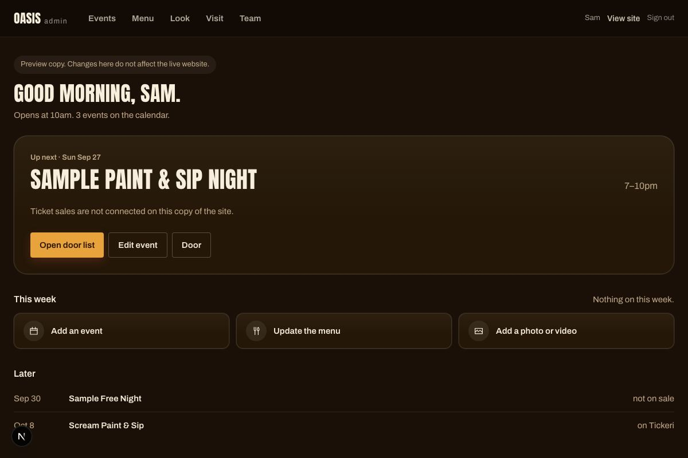
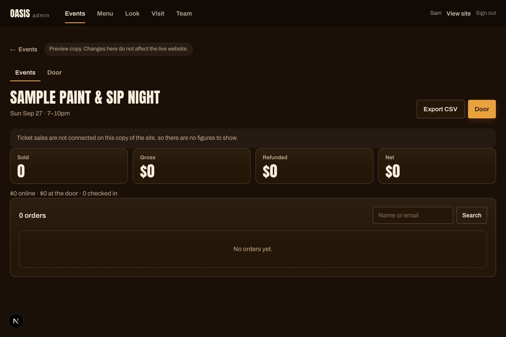
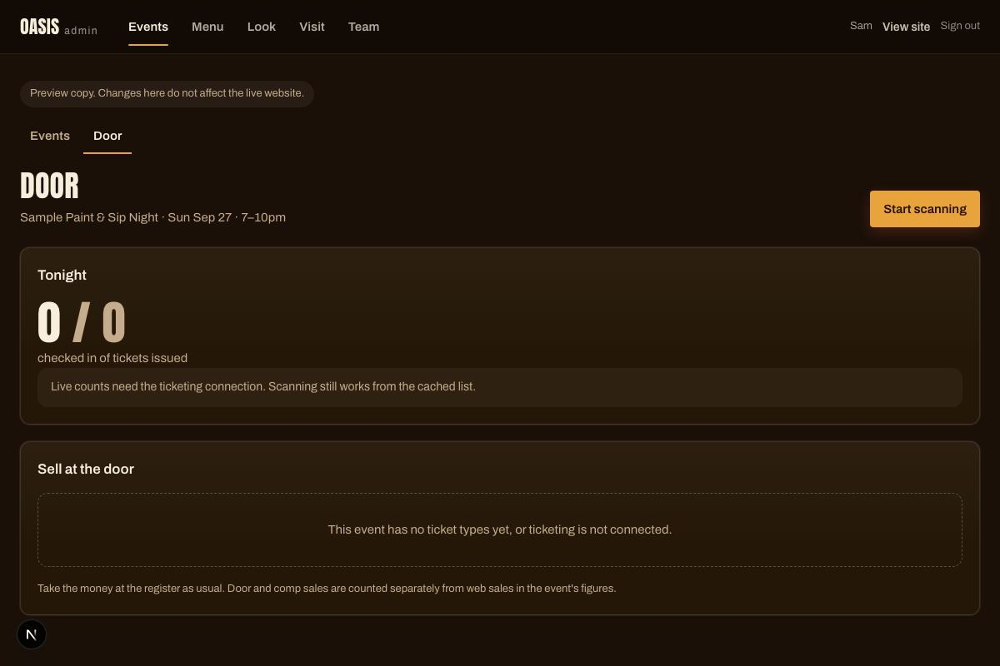
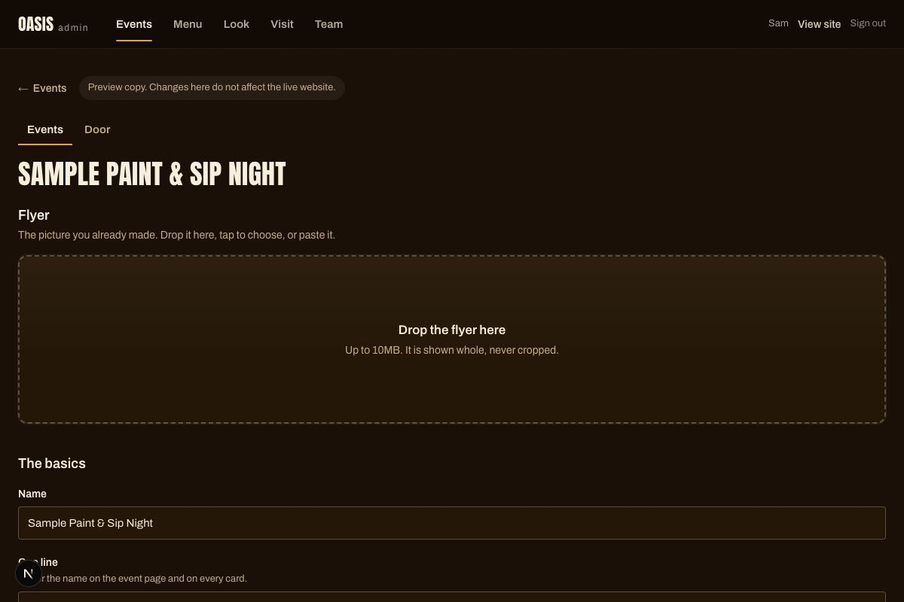

# Runbook — the four things you will actually do

Written for the owner and managers. Everything here is done from the admin at
`/admin` on a phone or a laptop. Screenshots are from a development copy with sample data.

---

## 1. How many tickets have we sold for Saturday?

Open the admin. The first thing on the home screen is **Up next**: the next event, how many sold
of how many, the money collected, seats left, and when the last sale was.

For any other event: **Events** → the event → **Sales** (top right). Sold, gross, refunded, net,
online against door, and every order with the buyer's name and whether they have been let in.
**Export CSV** gives you the door list on paper.

## 2. Someone says they never got their ticket

**Events** → the event → **Sales**. Search their name or email. On their row, tap **Resend
tickets**. It goes to the email on the order; ask them to check spam. If the email on the order is
wrong, tell them to open their tickets page from the receipt link and use "Email these to me
again" — or take the order number and let them in from the door screen.

Every email we ever tried to send is logged, so a developer can see in seconds whether it went out
and what the mail service said.

## 3. Refund an order

**Events** → the event → **Sales** → find the order → **Refund** → confirm the amount. A card
refund goes to Stripe; the tickets read "No longer valid" within a moment and will scan red at the
door. A door or comp order is marked refunded on the spot — give the money back at the register.

Refunds made in the Stripe Dashboard do the same thing; the website finds out through Stripe.

To cancel a whole event, open it in **Events** and choose **Cancel event** at the bottom. Every
order is refunded, every ticket voided, and the event stays on the website marked cancelled.

## 4. Comp someone in, or sell at the door

**Events** → **Door** (or **Door** on the home screen's Up next card). Pick the ticket type and
how many, choose **Cash or card at the register** or **Comp**, add a name and, for a comp, a
reason. **Sell and check in** records the sale and lets them in in one tap. Door and comp sales are
counted separately from online sales.

**Start scanning** on the same screen opens the camera. Green means in. Amber means the code was
already used — you decide, "Let them in anyway" records that you did. Red means not valid here, and
says why. If the wifi drops, keep scanning: the list was saved to the phone when the screen opened
and the check-ins sync when it is back.

---

## Adding an event, for reference

**Events** → **New event**. Flyer first, then the name, the date, tickets on or off, prices. It
saves as you go. **Publish — tickets go on sale immediately** does exactly that.

