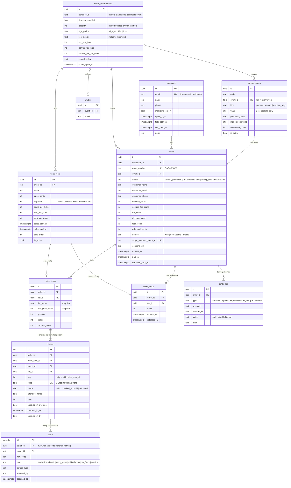

# Ticketing schema

What the ticketing tables are, why each one exists, and how the brief's names map
onto them. The behaviour that sits on top — reservation, pricing, fulfilment —
is in `docs/ticketing.md`; the payment flow is in `docs/stripe-setup.md`.

Migrations: `0006_waitlist.sql`, `0007_ticketing_core.sql`,
`0009_email_log_and_reminders.sql`, `0012_harden_ticketing_functions_and_indexes.sql`,
`0013_import_tickeri_ticket_data.sql`, `0014_fix_crockford_random_and_add_service_fee.sql`,
`0015_customers_and_promoter_attribution.sql`, `0016_revoke_trigger_function_execute.sql`.

**Applied to the live project** (`yrfvnqgybbvbkwonvycw`) on 18 September 2026, and verified
there by the walkthrough below.

---

## The diagram

`processed_stripe_events` stands alone: it has no foreign keys by design.

---

## The tables

### `event_occurrences` — the event

There is no separate `events` table. A ticketed event **is** a standalone
`event_occurrences` row (`series_slug is null`), which is why the site can put an
event on sale without re-entering anything that was already on its page. The id
is `text` (`tickeri:xxxx` for rows imported from Tickeri, a uuid string for rows
created in the admin), so every ticketing table references `event_id text`.

Migration `0007` added the selling columns listed in the diagram.
`ticketing_enabled` is the switch: off, and the event page falls back to the
outside ticket link or the door. `fee_display` decides whether the tier price is
the price (`inclusive`) or fees are added as visible lines (`itemized`), and
`tax_rate_bps` stays at 0 until an accountant confirms these admissions are
taxable in Lockport — a rate is a setting, never a migration.

### `ticket_tiers` — what is for sale

Adult, Kid, Table of 4, VIP. Prices are integer cents. `capacity` null means
unlimited within the event's own cap. `seats_per_ticket` is what makes a table
sale honest: one "Table of 4" ticket consumes four seats of capacity.
`min_per_order` / `max_per_order` bound the stepper on the event page, and
`sales_start_at` / `sales_end_at` give each tier its own window (early bird
closing before general admission opens needs no code).

### `promo_codes` — discounts and attribution

`percent`, `amount`, or `tracking_only` — a code worth nothing off the price
whose whole job is to say who brought the room. Optionally scoped to one event,
optionally capped by `max_redemptions`, and unique on
`(upper(code), coalesce(event_id, ''))`, so the same word can mean different
things at two different events but never twice at one.

`redeemed_count` is incremented in `fulfill_order`, which means it counts
tickets that were actually paid for rather than checkouts somebody started.
With `promoter_name` and the orders carrying the code, that is a payout report.

### `customers` — the list that is ours

Keyed by lowercased email and persisting across events: the asset Tickeri
currently owns. A `before insert or update of status` trigger on `orders` links
one the moment an order is paid, whichever way it was paid — web, door, comp or
a free order — so nothing has to remember to call anything. Name and phone only
ever overwrite when the incoming value is non-empty, so a door sale with no name
cannot blank out what an earlier order knew.

`marketing_opt_in` is false until the guest says otherwise, and `opted_in_at`
records when. Lifetime tickets and spend are **not** columns here: they are
computed from orders, for the same reason availability is computed from orders.
A refund never deletes a customer.

### `orders` — one purchase

Human-readable `order_number` (`OAS-XXXXX`, Crockford base32 with no I/L/O/U so it
can be read aloud at a door). `status` carries the whole life of the sale, and the
`orders_balance` check constraint means the row always adds up:
`total = subtotal + service_fee + tax − discount`. `source` separates a web sale
from a door sale, a comp and an imported Tickeri record, which is what makes the
sales figures real rather than decorative. `stripe_payment_intent_id` is unique —
that uniqueness is part of the idempotency story. `consent_text` and `consent_at`
persist the exact refund policy the guest agreed to, because the policy on the
page can change after they bought.

### `order_items` — the lines of the sale

A snapshot, deliberately. `tier_name` and `unit_price_cents` are copied at order
time, so renaming or repricing a tier next month never rewrites last month's
receipt. `seats` is the capacity the line consumed, which is not the same as
`quantity` when a tier admits more than one person.

### `tickets` — one row per admitted person

Four tickets in an order are four rows. `code` is an unguessable 8-character
Crockford string; the QR carries a signed payload built from it
(`src/lib/ticketing/tokens.ts`) rather than the raw row id, and nothing personal
is inside it. `unique (order_item_id, seq)` is what makes minting idempotent: a
replayed webhook cannot insert a second ticket #1. `status` covers `valid`,
`checked_in`, `void` and `refunded`; `checked_in_at` / `checked_in_by` record the
first scan that won, and `checked_in_override` marks the times staff let someone
through on a duplicate.

### `ticket_holds` — the twelve minutes between choosing and paying

A pending order holds its seats for twelve minutes so two people cannot buy the
last one while both are typing a card number. Availability is computed from
orders rather than from this table; the holds exist so a reservation can be
inspected and released explicitly. `release_expired_holds()` runs at the top of
every reservation and again every five minutes from
`/api/cron/release-holds` — hygiene, not correctness.

### `scans` — every scan attempt, including the failures

Append-only. A scan of something that isn't ours still writes a row with
`ticket_id null` and the raw code, which is what turns "someone was passing
screenshots around at 8:47" from a suspicion into a record. `result` is one of
`ok`, `duplicate`, `invalid` (not one of our codes at all), `not_found` (looks
like one and matches nothing), `wrong_event`, `void`, `refunded` and `override`
— each its own message at the door, never a generic "invalid".

### `email_log` — did her ticket actually arrive?

Every ticket email attempted, with the provider's message id and any error, so
that question is answerable from the admin in five seconds instead of from a
support inbox in a day.

### `waitlist` — the sold-out queue

Email plus event, unique per pair. The only ticketing-adjacent table with a
public insert policy; staff read it through server code.

### `processed_stripe_events` — the idempotency guard

Every Stripe event id that has been handled. The primary key **is** the guard: a
replayed webhook fails the insert and returns 200 without touching an order.

### Views

`event_sales_summary` (per event: sold, seats taken, checked in, gross, refunded,
net, web vs door, comps, last sale) and `event_attendees` (per ticket: the door
list, joined to the order). Both are `security_invoker` and revoked from `anon`;
server code reads them with the service role.

---

## Functions

| Function | What it is for |
|---|---|
| `crockford_random(length)` | Unambiguous codes — no I, L, O or U to misread at a door. |
| `generate_order_number()` / `generate_ticket_code()` | `OAS-XXXXX` and the 8-character ticket code, retried on collision. |
| `tier_seats_taken(tier)` / `event_seats_taken(event)` | Seats consumed by paid orders **and** pending orders whose hold has not expired. |
| `get_event_availability(event)` | The single read every surface uses: event totals plus per-tier `available`, bounded by both the tier cap and the event cap. |
| `release_expired_holds()` | Marks lapsed holds released. Called by every reservation and by the cron. |
| `price_order(...)` | The money, in one place: discount, then fees, then tax, in both fee modes. |
| `reserve_order(event, items, promo, hold_minutes, source)` | One transaction: lock the event row, re-check availability, price it, write the order, its items and its hold. |
| `fulfill_order(order, charge, paid_at)` | Marks the order paid and mints one ticket per admitted person. Idempotent. |

Availability is never stored as a counter. There is no `tickets_remaining`
column anywhere, and that is the point: a counter and a set of rows disagree
eventually, and the night they disagree is the night the room is oversold.

---

## Row-level security

Every ticketing table has RLS enabled. The important part is what has **no
policy at all**:

| Table | Anonymous | Authenticated staff |
|---|---|---|
| `orders`, `order_items`, `tickets`, `ticket_holds`, `scans`, `email_log`, `processed_stripe_events` | **no policy — denied** | **no policy — denied** |
| `ticket_tiers` | read, only where the tier is active and its event is published | full write with `can_publish()` |
| `promo_codes` | denied | full with `can_publish()` |
| `waitlist` | insert only | read through server code |

Orders, tickets and scans are reachable **only** through server routes holding
`SUPABASE_SERVICE_ROLE_KEY`, which is never exposed with a `NEXT_PUBLIC_` prefix
and never reaches the browser bundle. The public ticket page resolves a signed
token server-side and then reads with the service role; it never issues a
client-side query by token.

The money functions are revoked from `public`, `anon` and `authenticated` and
granted to `service_role` only. `get_event_availability` is the single exception,
readable by anyone — it returns counts, never a buyer.

---

## The brief's names, and these

| Brief (`01-database-schema.md`) | Here | Why |
|---|---|---|
| `events` | `event_occurrences` (standalone rows) | Events already existed with a page, artwork, a flyer and an admin editor. A parallel table would have split the site in two. |
| `ticket_types` | `ticket_tiers` | Same thing, built from day one as the brief asks. |
| `tickets.token` | `tickets.code` + a signed QR payload | The code is what staff read aloud; the QR carries an HMAC-signed payload so a forged QR fails offline. |
| `check_ins` | `scans` | Append-only log of every attempt, failures included. Only the name differs: `duplicate` is the brief's `already_checked_in`. |
| `holds` | `ticket_holds` | Keyed by order rather than by Stripe session, because the hold is created before Stripe is involved. |
| `staff` | `profiles` + `roles` (migration `0003`) | Staff, roles and capabilities already existed for the admin area. |
| `customers` | `customers` | Added in `0015`, linked from `orders.customer_id`. The name, email and phone stay on the order too: the order is the receipt. |
| `order_number` `OA-#####` | `OAS-XXXXX` | Already minted onto live orders and printed in emails. |

## Fixtures and the walkthrough

| File | What it does |
|---|---|
| `supabase/seeds/test-event.sql` | A `Test Event — $1` and a realistic 120-seat Saturday with GA and VIP tiers. Idempotent, and seeded **unpublished** so it is safe to run against the live database — publish the $1 event only for as long as a test takes. |
| `supabase/tests/ticketing-walkthrough.sql` | One transaction, always rolled back, that asserts the whole chain: four tickets issued, distinct codes, first scan wins, a second scan changes nothing, a replayed fulfilment mints nothing, a customer created once for a returning guest, a tracking-only code that attributes without discounting, and anonymous callers seeing no orders, tickets or customers. |
| `scripts/hammer-reserve.ts` | Fifty parallel reservations against a ten-seat tier; exactly ten succeed. Run it after any change to `reserve_order`. |

The walkthrough has been run against the live database: every check held, and the
transaction rolled itself back, leaving no test event, order, ticket, customer,
scan or promo code behind.

## Known gaps against the brief

1. **Guest list without a transaction.** A comp is a zero-total order today,
   which works and reaches the door manifest, but there is no separate
   guest-list concept (phase 05).
2. **Consent is collected, opt-in is not.** `customers.marketing_opt_in` exists
   and nothing sets it yet: the checkout has no opt-in checkbox (phase 02).
